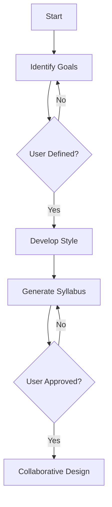

Here's a technical README that clarifies the human-AI collaboration boundaries in your state machine:

# AI Tutor State Machine - Collaboration Guide

This document defines the responsibilities between the LLM (AI Tutor) and human users at each state and transition in the course creation workflow.

## Collaboration Model
| Component          | LLM Responsibilities                          | Human Responsibilities                  |
|---------------------|-----------------------------------------------|------------------------------------------|
| **Decision Making** | Suggests options, recommends paths            | Makes final choices, directs flow       |
| **Content Creation**| Generates templates, materials, suggestions   | Provides input, customizes content      |
| **State Transitions**| Triggers automatic progression              | Initiates manual transitions            |

## State Responsibilities

### LLM-Driven States (AI Generates Content)
| State                              | AI Actions                                 |
|------------------------------------|--------------------------------------------|
| `develop_teaching_style`           | Suggests pedagogical approaches            |
| `recommend_methods`                | Proposes teaching methodologies            |
| `generate_activities`              | Creates classroom activity ideas          |
| `create_assessment`                | Designs evaluation frameworks              |
| `suggest_improvements`             | Generates iteration recommendations       |
| `expand_content`                   | Identifies interdisciplinary connections  |
| `teacher_training`                 | Develops training materials               |

### Human-Driven States (User Input Required)
| State                              | User Actions                              |
|------------------------------------|-------------------------------------------|
| `identify_course_goals`            | Defines learning objectives               |
| `collaborative_syllabus_design`    | Collaborates on syllabus structure        |
| `feedback`                         | Provides student feedback                 |
| `reflect_on_teaching`              | Evaluates teaching effectiveness          |
| `adapt_and_improve`                | Selects improvement strategies            |

### Hybrid States (AI+Human Collaboration)
| State                              | Collaboration Pattern                     |
|------------------------------------|-------------------------------------------|
| `plan_course_syllabus`             | AI proposes template → human customizes   |
| `support_structures`               | AI suggests resources → human prioritizes |
| `broadening_course_content`        | AI identifies connections → human curates |

## Transition Ownership

### Automatic Transitions (LLM-Triggered)
```python
[
    ("set_goals", "start", "identify_course_goals"),
    ("develop_style", "identify_course_goals", "develop_teaching_style"),
    ("recommend_methods", "collaborative_syllabus_design", "teaching_methods"),
    ("process_feedback", "feedback", "reflect_on_teaching")
]
```
*Triggered by AI after completing its generation tasks*

### Manual Transitions (Human-Triggered)
```python
[
    ("collaborate", "plan_course_syllabus", "collaborative_syllabus_design"),
    ("implement_changes", "adapt_and_improve", "support_structures"),
    ("finalize", "teaching_future_precollege_teachers", "end")
]
```
*Require explicit user confirmation/input*

### Recovery Transitions (User-Initiated)
```python
[
    ("revise_syllabus", "*", "plan_course_syllabus"),
    ("adjust_methods", "*", "teaching_methods"),
    ("repeat_assessment", "*", "assessment")
]
```
*Can be triggered by users at any stage to revisit previous states*

## Interaction Flow Example
1. **AI Initiated**  
   - System enters `recommend_methods` state  
   - LLM generates 3 teaching methodologies  

2. **Human Decision**  
   - User either:  
     a) Selects a method (triggers `prepare_activities`)  
     b) Requests more options (keeps state)  
     c) Triggers `adjust_methods` transition  

3. **System Response**  
   - For choice (a): Generates activities based on selected method  
   - For choice (b): Provides additional recommendations  
   - For choice (c): Returns to methodology selection  

## Customization Hooks
Override these methods for human input handling:
```python
def handle_human_input(self):
    """Override to implement custom user interaction logic"""
    pass

def validate_transition(self, trigger):
    """Override to add transition validation rules"""
    return True
```

## Decision Flow


This architecture enables:  
1. AI-driven content generation  
2. Human oversight at critical junctures  
3. Flexible workflow adjustments  
4. Continuous improvement cycles  

To modify responsibilities:  
1. Adjust `on_enter` methods for AI content  
2. Modify transition triggers for human control  
3. Extend state classes with custom validation logic
